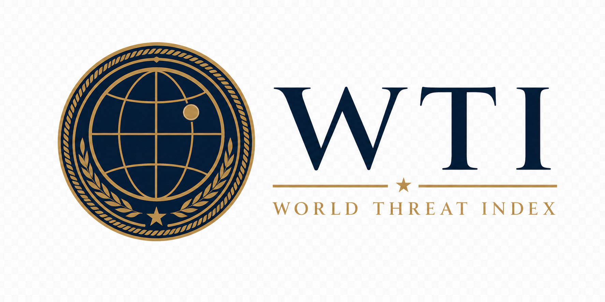

<div align="center">
  

  # World Threat Index
  ### A standing geopolitical assessment of 195 states and 13 blocs

  
  
  
  
  
  
</div>

> ASSESSMENT · OPEN SOURCE · UNCLASSIFIED

---

## Executive Summary

The **World Threat Index (WTI)** is a standing geopolitical assessment maintained by the Strategic Data Company of Ankara. It measures threat pressure across **195 United Nations member states (plus Taiwan, for 196 territories)** and **13 major geopolitical blocs**, rendering each onto a single, comparable **1–10 scale**. The Index ingests multilingual open-source reporting, attributes each event to a country and a canonical threat category, and applies a deterministic, audit-ready scoring model to yield decision-grade situational awareness for analysts, risk officers, and strategy teams.

The assessment is regenerated every few hours and published to a live, public dashboard with full provenance. Because scoring is deterministic given fixed inputs, every headline figure on that dashboard can be traced back to the events that produced it.

**Live assessment:** **https://sdcofa.github.io/world-threat-index/**

---

## The Assessment

The Index converts the daily volume of international reporting into one comparable threat figure per country and per bloc, refreshed around the clock. It is designed to answer a single question consistently across the entire globe: *where is threat pressure rising, and by how much, relative to everywhere else.*

- **Global coverage.** Every UN member state plus Taiwan (196 territories) and **13 geopolitical blocs**: OECD, G7, G20, EU, USMCA, NATO, ASEAN, African Union, BRICS, GCC, CIS, MERCOSUR, and SCO.
- **A single comparable scale.** A shared, BNTI-compatible weighting model maps attributed events to a 1–10 index with three declared status bands: **STABLE**, **ELEVATED**, and **CRITICAL**.
- **Continuous, tiered cadence.** States are graded into tiers A / B / C and reassessed every **2 / 6 / 12 hours** respectively, on a scheduled basis.
- **Weighted aggregation.** A population-weighted **global composite** and GDP-weighted **bloc indices**, so headline numbers reflect real geopolitical weight rather than raw event counts.
- **Live, zero-backend presentation.** An interactive D3 world choropleth, a bloc grid, and country rankings, served as a static site with no server dependency.

---

## Methodology & Provenance

The Company holds to a single discipline — *evidence before assertion*. Every figure the Index publishes is reproducible from its sources, and every datum carries its source, its collection context, and the method by which it was scored.

### The assessment pipeline

1. **Ingestion.** Google News RSS mirrors are pulled per country, with optional GDELT event enrichment enabled via `WTI_INCLUDE_GDELT=true`.
2. **Attribution.** An LLM model (`openrouter/free`) assigns each event a canonical ISO-2 country code and a threat category. A deterministic heuristic mode (`--dry-run`) executes the identical flow with no LLM dependency.
3. **Scoring.** Category weights are applied and volume-normalised into a per-country **1–10 index** through a saturating curve (see model below).
4. **Aggregation.** A population-weighted **global composite** is computed alongside GDP-weighted **bloc indices** for all 13 groups.
5. **Publication.** Results are sharded across the country universe, merged, gated at the bloc level, committed, and deployed atomically.

### Scoring model

Each attributed event carries a category weight; the country's mean weight is mapped through a saturating curve onto a bounded 1–10 index.

| Threat category | Weight |
|---|---:|
| Military conflict | 8.0 |
| Terrorism | 7.0 |
| Border security | 5.0 |
| Political instability | 4.0 |
| Humanitarian crisis | 3.0 |
| Diplomatic tensions | 2.5 |
| Trade agreement | −2.0 |
| Neutral | 0.0 |

| Status | Index range |
|---|---|
| **STABLE** | 1.0 – 4.0 |
| **ELEVATED** | 4.0 – 7.0 |
| **CRITICAL** | 7.0 – 10.0 |

The methodology is adapted from the production [Border Neighbor Threat Index (BNTI)](https://github.com/akgularda/border-neighbor-threat-index) and is documented in full at [`docs/wti-methodology.md`](docs/wti-methodology.md).

### Provenance discipline

- **Auditability.** Scoring is fully deterministic given the same inputs. The dashboard surfaces the last-update timestamp and live coverage, so any published number can be traced to the run — and the events — that produced it.
- **Lawful collection only.** The Index draws exclusively from open, lawfully accessible sources. No collection occurs behind authentication the Company was not granted.

---

## Coverage

- **196 territories** — all 195 UN member states plus Taiwan.
- **13 geopolitical blocs** — OECD, G7, G20, EU, USMCA, NATO, ASEAN, African Union, BRICS, GCC, CIS, MERCOSUR, SCO.
- **Tiered reassessment** — Tier A every ~2 hours, Tier B every ~6 hours, Tier C every ~12 hours.
- **Parallel pipeline** — the country universe is divided into **10 independent shards** that run concurrently, then merge and publish as one atomic dataset.

### Preview


---

## Data & Sources

| Element | Detail |
|---|---|
| **Sources** | Public news RSS feeds, mirrored per country; optional GDELT event enrichment. |
| **Country registry** | `config/countries.json` — 195 states plus Taiwan, with region, subregion, tier, population, and GDP fields used for weighting. |
| **Bloc definitions** | `config/groups.json` — the 13 blocs, their members, and per-bloc weighting strategy (GDP or population). |
| **Published dataset** | `wti_data.json` / `wti_data.js` — the latest scored index per country and bloc, regenerated each run. |
| **Attribution model** | OpenRouter (`openrouter/free`), with primary-and-backup key rotation and a deterministic heuristic fallback. |

The Company collects only what the intelligence question requires, from open sources, and retains the trace from source to published figure.

---

## Reproduction

The assessment is reproducible from a clean checkout. The commands below mirror exactly what the automated pipeline runs.

```bash
# 1. Install dependencies
pip install -r requirements.txt

# 2. Dry-run a few countries (no LLM, Google News only)
python worldthreatindex.py --dry-run --countries US,GB,SY,UA

# 3. Run a production shard (as the pipeline does)
python worldthreatindex.py --shard 0 --total-shards 10 --output-shard 0 --tier A

# 4. Merge all shards into the published dataset
python scripts/merge_wti_shards.py

# 5. Validate global coverage
python scripts/validate_wti_coverage.py
```

LLM attribution reads `OPENROUTER_API_KEY` (and `OPENROUTER_API_KEY_BACKUP`) from the environment; keys are never committed. Use `--dry-run` for fully local, LLM-free operation.

### Automation & deployment

- **`.github/workflows/wti_update.yml`** — *WTI Intelligence Update*: scheduled tiered refresh (Tier A ~2h, B ~6h, C ~12h), 10 parallel shards → merge → commit → Pages deploy.
- **`.github/workflows/pages.yml`** — *Deploy GitHub Pages*: publishes the static dashboard on every push to `main`.

### Technical stack

- **Data / ETL** — Python 3.11: `feedparser`, `pandas`, `numpy`, `requests`, `python-dateutil`, `googletrans`.
- **Attribution model** — OpenRouter (`openrouter/free`) with key rotation and a heuristic fallback.
- **Frontend** — vanilla JavaScript with **D3.js v7** (world choropleth) and **Chart.js**; modular CSS (`variables`, `layout`, `components`, `wti`).
- **Automation** — GitHub Actions: a 10-way sharded matrix on a tiered cron schedule, merge-and-publish, then Pages deploy.
- **Hosting** — GitHub Pages (static, no backend).
- **Tests** — `pytest` suite under `tests/`.

### Repository layout

| Path | Purpose |
|---|---|
| `worldthreatindex.py` | Main analyzer / pipeline entrypoint |
| `wti_core/` | `ingestion`, `feeds`, `llm`, `scoring`, `groups`, `publish` |
| `config/countries.json` | 195-country + Taiwan registry with tiers and weights |
| `config/groups.json` | 13 bloc definitions and weighting strategy |
| `scripts/` | Shard merge, coverage validation, registry build |
| `js/` · `css/` · `index.html` | Static dashboard (map, groups, rankings) |
| `wti_data.json` / `wti_data.js` | Latest published dataset |
| `docs/wti-methodology.md` | Full scoring methodology |

---

## Standards

- **Public sources only.** Collection is confined to open, lawfully accessible reporting.
- **Provenance and auditability.** Every datum is traceable to its source and time; deterministic scoring makes every published figure reproducible.
- **Minimised personal data.** The Index assesses states, blocs, and events — not private individuals.
- **Defensive and analytical framing.** The Company assesses threat pressure; it does not build tooling for targeting or intrusion.
- **License.** Apache License 2.0 — see [`LICENSE`](LICENSE). © 2026 Monarch Castle Holdings · Ankara, Türkiye.

---

> A standing index of the **Strategic Data Company of Ankara** — a constituent house of [Monarch Castle Holdings](https://github.com/MonarchCastleHoldings). Sister company: [Monarch Castle Technologies](https://github.com/monarchcastletech).

<div align="center"><sub>STRATEGIC DATA COMPANY OF ANKARA · ANKARA · TÜRKİYE · MMXXVI</sub></div>
