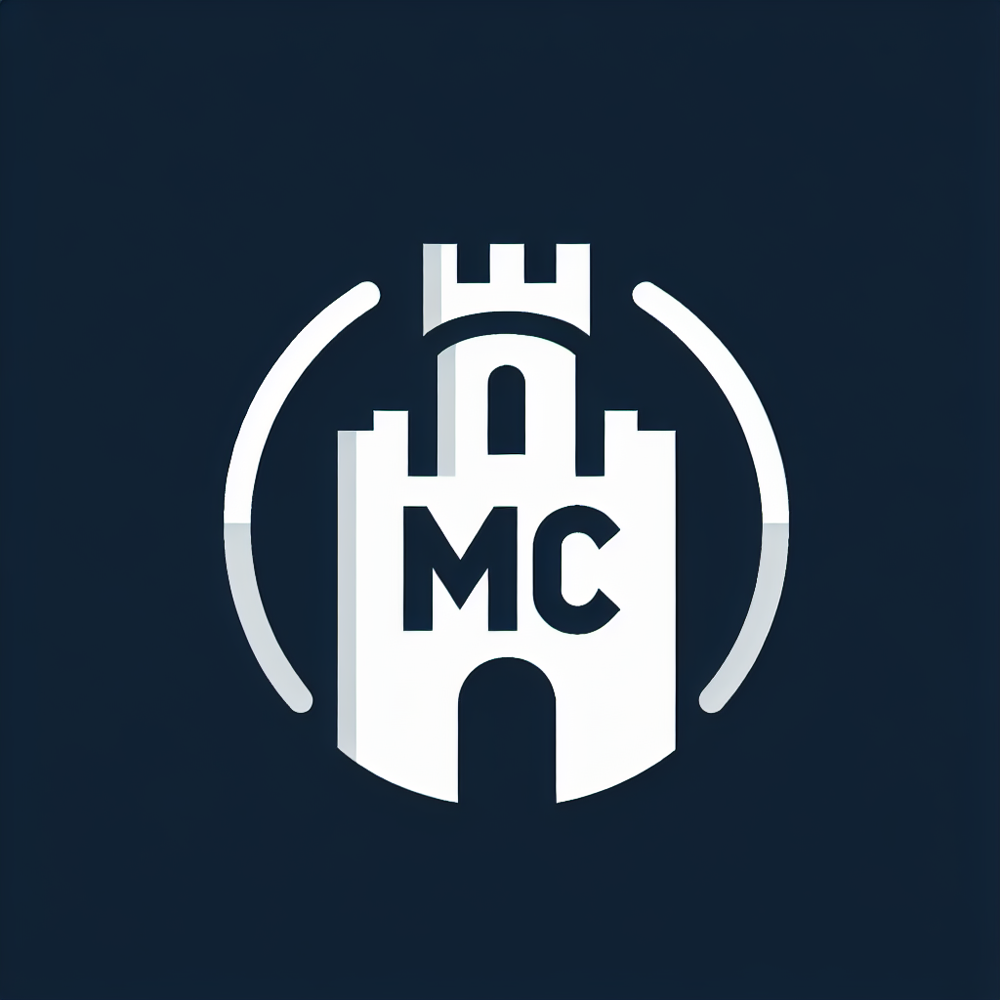

<p align="center">
  
</p>

<h1 align="center">World Threat Index (WTI)</h1>

<p align="center"><strong>Monarch Castle Technologies | Defense Intelligence</strong></p>

<p align="center">
  <a href="https://akgularda.github.io/world-threat-index/">Live Dashboard</a>
  |
  <a href="docs/wti-methodology.md">Methodology</a>
</p>

<p align="center">
  <a href="https://opensource.org/licenses/Apache-2.0"></a>
  <a href="https://www.python.org/downloads/"></a>
  <a href="https://openrouter.ai/"></a>
</p>

## Overview

World Threat Index (WTI) monitors geopolitical threat pressure across **195 countries** and **13 major blocs** (OECD, G7, G20, EU, USMCA, NATO, ASEAN, AU, BRICS, GCC, CIS, MERCOSUR, SCO).

The pipeline ingests multilingual news, uses `openrouter/free` for country attribution and threat categorization, then applies deterministic BNTI-compatible scoring to produce a 1–10 index per country and group.

Methodology is derived from the [Border Neighbor Threat Index (BNTI)](https://github.com/akgularda/border-neighbor-threat-index).

## Quick Start

```bash
pip install -r requirements.txt

# Dry-run (no LLM, Google News only)
python worldthreatindex.py --dry-run --countries US,GB,SY,UA

# Production shard (GitHub Actions)
python worldthreatindex.py --shard 0 --total-shards 10 --tier A --output-shard 0
python scripts/merge_wti_shards.py
```

## Repository Layout

| Path | Purpose |
|------|---------|
| `worldthreatindex.py` | Main analyzer |
| `wti_core/` | Scoring, feeds, LLM, publish, groups |
| `config/countries.json` | 195-country registry with tiers |
| `config/groups.json` | Geopolitical group definitions |
| `wti_data.json` | Latest published dataset |
| `index.html` | Dashboard |
| `.github/workflows/wti_update.yml` | Automated tiered updates |

## Citation

```bibtex
@software{wti2026,
  author = {Akgul, Arda},
  title = {World Threat Index: Global Geopolitical Risk Assessment},
  year = {2026},
  url = {https://github.com/akgularda/world-threat-index}
}
```

## License

Apache License 2.0. See `LICENSE`.